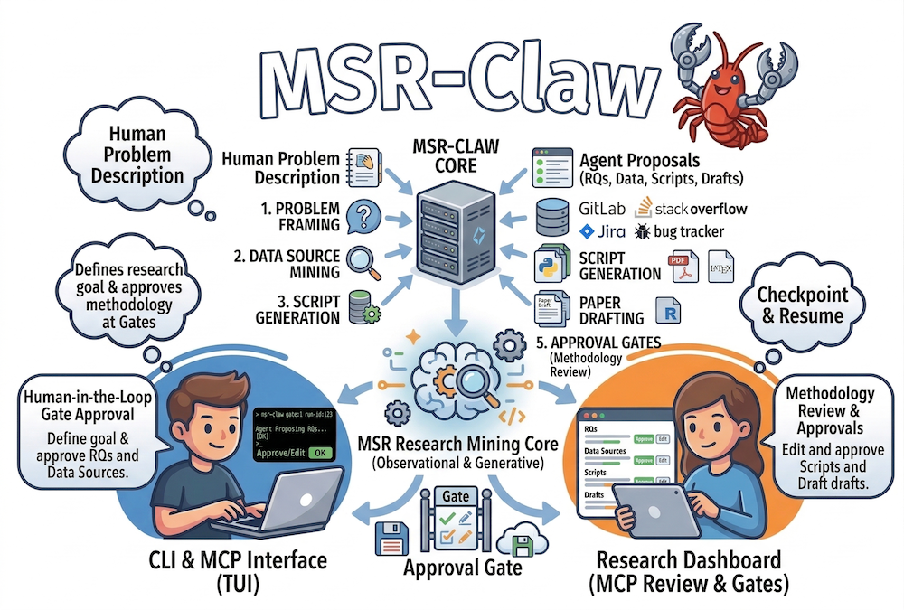

<div align="center">
  
  <h1>MSR-Claw</h1>
  <p><strong>Human-in-the-loop multi-agent mining software repository research</strong></p>
  <p>
    <code>MSR-Claw</code> helps you move from a research problem to questions, data sources, collection and analysis scripts, and paper drafts, with explicit approval gates and resumable runs via CLI or MCP.
  </p>
  <p>
    <a href="https://github.com/just-claw-it/msr-claw">
      
    </a>
    <a href="https://github.com/just-claw-it/msr-claw/actions/workflows/ci.yml">
      
    </a>
    <a href="LICENSE">
      
    </a>
  </p>
</div>

---

- **Orchestration:** [LangGraph](https://github.com/langchain-ai/langgraph) with `interrupt()` for human gates  
- **LLM:** OpenAI-compatible HTTP API (`LLM_BASE_URL`, `LLM_API_KEY`, `LLM_MODEL`)  
- **Persistence:** Per-run workspace on disk, SQLite checkpoints for the graph, and a global `provenance.db` for run metadata and decisions  

**Model quality:** Prefer **GPT-4o-class** (or similar) models. Smaller models often produce brittle collection scripts and invalid JSON in agent steps.

**LLM tailoring (when not in mock mode):** The problem step produces a **`research_plan`** (saved as `runs/<run_id>/research_plan.json`) used downstream. With **`MSRCLAW_LLM_SCRIPTS=1`** (default), the model can author **collection**, **analysis**, and optional **figure** scripts tied to your problem; otherwise the pipeline uses template fallbacks. See **`docs/SCRIPT_LLM.md`** for details and **`MSRCLAW_LLM_SCRIPTS=0`** to disable script synthesis.

---

## OpenClaw and related tools

MSR-Claw is designed to work well with **OpenClaw-style orchestration** (and any coding agent): see **`MSRCLAW_AGENTS.md`** for bootstrap steps and gate JSON.

**Important naming note:** In upstream OpenClaw docs, the old **TCP JSONL “Bridge protocol”** is **legacy**; current integrations use the **Gateway WebSocket** protocol. [AutoResearchClaw](https://github.com/aiming-lab/AutoResearchClaw) also uses the name **`openclaw_bridge`** in YAML for **optional adapters** (cron, messaging, memory, …) — that is **not** the same as embedding the deprecated TCP bridge inside this repo.

MSR-Claw does **not** bundle OpenClaw’s gateway or legacy bridge. [OpenClaw](https://github.com/openclaw/openclaw) itself is a **Node** stack (Gateway WebSocket, channels, workspace `AGENTS.md` / skills, host tools like `bash`). MSR-Claw integrates the **usual** way: the OpenClaw agent runs **`msr-claw`** or **`msr-claw mcp`** after you add **`MSRCLAW_AGENTS.md`** (or a skill) to the workspace.

- **Agent-driven runs** via `MSRCLAW_AGENTS.md` (same *idea* as ARC’s agent docs).
- **Automation** via **MCP** (`msr-claw mcp`) or by importing **`msrclaw.run_service`** from Python (same logic as the CLI).

For **how OpenClaw is structured**, a **comparison** with AutoResearchClaw, and a **roadmap**, see **`docs/OPENCLAW.md`**.

---

## Requirements

- **Python 3.11+**
- An OpenAI-compatible API endpoint and key (or a local server exposing the same chat API)

---

## Install

```bash
git clone <repository-url>
cd msr-claw
python3.11 -m venv .venv
source .venv/bin/activate   # Windows: .venv\Scripts\activate
pip install -e .
```

Optional:

- **MCP (IDE integration):** `pip install -e ".[mcp]"` then `msr-claw mcp` (stdio)
- **Development:** `pip install -e ".[dev]"` (add `[mcp]` if you run MCP tests)

---

## Configuration

Copy the example config and adjust paths and secrets:

```bash
cp msrclaw.yaml.example msrclaw.yaml
```

`msrclaw.yaml` supports `${ENV_VAR}` substitution. Typical environment variables:

| Variable | Purpose |
|----------|---------|
| `LLM_BASE_URL` | API base URL (e.g. `https://api.openai.com/v1`) |
| `LLM_API_KEY` | API key |
| `LLM_MODEL` | Model name (e.g. `gpt-4o`) |
| `GITHUB_TOKEN` | GitHub collection (if using the `github` source) |
| `MSRCLAW_LLM_SCRIPTS` | `1` (default): LLM-authored collection / analysis / figure scripts; `0`: templates only |
| `MSRCLAW_MOCK_LLM` | Set to `1` for stub outputs (tests, CI) — no LLM calls, no LLM script synthesis |
| `MSRCLAW_CONFIG` | Absolute path to `msrclaw.yaml` when it is not in the current working directory (used by MCP; use **`--config`** on the CLI) |

CLI commands that read config accept **`--config` / `-c`**:

```bash
msr-claw init "Your problem" --config /path/to/msrclaw.yaml
msr-claw resume <run_id> --config /path/to/msrclaw.yaml
msr-claw list --config /path/to/msrclaw.yaml
```

The same **`--config` / `-c`** flag works for **`status`** and **`export`**.

---

## CLI

```bash
msr-claw init "Your MSR research problem description"
msr-claw resume <run_id>
msr-claw status <run_id>
msr-claw list
msr-claw export <run_id> --out replication.zip
msr-claw mcp         # optional MCP stdio server (requires [mcp] extra)
```

At each gate, respond with a **single line of JSON**, for example:

```json
{"choice":"approve","rationale":"Looks good"}
```

Useful `choice` values include `approve`, `approve_all`, `a`, `abort`, `x`, and (on collection failure) `retry`, `skip`, `s`. You can also send structured edits where supported (e.g. `rqs`, `candidate_sources`, `approved_source_names`).

**Offline / CI:** set `MSRCLAW_MOCK_LLM=1` so agents use stub outputs without calling an LLM.

---

## MCP server

For Claude Desktop, Cursor, or any MCP-capable client:

```bash
pip install -e ".[mcp]"
export MSRCLAW_CONFIG=/path/to/msrclaw.yaml   # if msrclaw.yaml is not beside your cwd
msr-claw mcp
```

Configure the client to launch that command. Tools: `msrclaw_start_run`, `msrclaw_resume_run`, `msrclaw_get_snapshot`, `msrclaw_list_runs` (see **`MSRCLAW_AGENTS.md`**). The same behavior is available from Python via **`msrclaw.run_service`**.

### OpenClaw skill template

Copy `skills/msr-claw/` into `~/.openclaw/workspace/skills/msr-claw/` on the machine where OpenClaw runs shell commands, or keep the repo checked out and follow **`MSRCLAW_AGENTS.md`**.

---

## Workspace layout

Configured `workspace_dir` (from `msrclaw.yaml`) holds:

- **`provenance.db`** — All runs, gate decisions, and related provenance tables  
- **`runs/<run_id>/`** — That run’s scripts, data, figures, paper drafts, `checkpoints.sqlite`, logs  

Generated artifacts include `scripts/collection/`, `scripts/analysis/`, `data/raw/`, `data/processed/`, `figures/`, `research_plan.json`, `paper/*.md`, `threats.md`, and (when created) `replication-guide.md`.

---

## Project layout (high level)

```
MSRCLAW_AGENTS.md   # bootstrap for OpenClaw / coding agents
docs/OPENCLAW.md    # ARC comparison, OpenClaw terminology, roadmap
docs/SCRIPT_LLM.md  # LLM scripts, research plan, env flags
skills/msr-claw/SKILL.md  # optional copy into ~/.openclaw/workspace/skills/
LICENSE
msrclaw/
  agents/           # pipeline agents; llm_generated_scripts, llm_tailoring
  codegen/          # template fallback for analysis scripts
  pipeline/         # LangGraph graph, state, gates, checkpoint coercion
  sources/          # plugins (e.g. GitHub); registry for new sources
  storage/          # workspace paths, provenance SQLite
  mock_llm.py       # request-scoped MSRCLAW_MOCK_LLM for run_service
  run_service.py    # checkpoint-backed runs (same core as CLI; used by MCP)
  mcp_server.py     # MCP stdio entry
  cli.py            # Typer entrypoint
```

---

## Development

```bash
pip install -e ".[dev,mcp]"
ruff check msrclaw tests
MSRCLAW_MOCK_LLM=1 pytest tests/
```

Tests that need `msrclaw.yaml` create a minimal config in a temporary directory (see `tests/test_graph_smoke.py`).

---

## License

This project is licensed under the MIT License — see [LICENSE](LICENSE).
